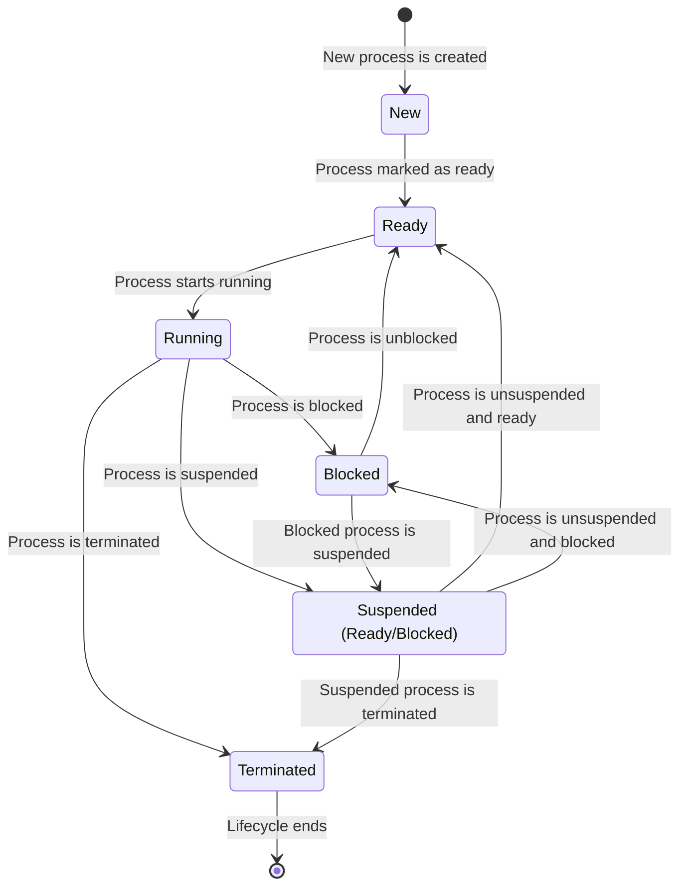

# Summary + Cheatsheet

# Brief Overview of Processes
- Processes are the manifestation of running programs in a system
## Properties of Processes
- Can be seen with `ps`
- Process ID
- Parent/child relationship
- User that created them
- Process priority
### Process State

- New
- Ready
- Running
- Blocked
- Suspended Ready/Blocked
- Terminated

## How processes are created
- On boot, the PID 1 is created, usually systemd
	- It runs all other processes on the system, so it's everyone's parent
- When you run a command in the terminal, a new process is created
	- The terminal is this process' parent
## Foreground x Background Processes
- Foreground processes can interact with the user, while background processes cannot
- Background processes stil sent their output to stdout
# Useful Commands
- `sleep` - useful when giving examples because it is very simple and runs for a long time
- `jobs`  - lists jobs
- `bg` and `fg` - move a process to the background/foreground, respectively
- `nohup` - make a process persist after the terminal is closed
	- stores the output in a nohup.out file
- `exec` - quits the terminal session when the command exists
- `nice` and `renice` - Change priority of a process, `renice` is used for already created process
- `top` displays a cool view of all process in the system, `htop` displays a cooler view
## `ps`
- `pgrep`
## `kill`
`pkill`
### Signals
#### Killer Signals
(From more to less dirty)
- 15 - SIGTERM
	- Terminate
	- Default signal sent by `kill`
	- More like a suggestion for the process to kill itself
- 2 - SIGINT
	- Interrupt
	 - Sent when we use `Ctrl + C`
 - 1 - SIGHUP
	 - A bit less extreme than kill -9
- 9 - SIGKILL
	- KILL a process
	- Forcibly kills the process
 
- 19 - SIGSTOP
	- Stop
	- Sent when we use `Ctrl + Z`
		- Or maybe it's 20 -SIGTSTOP
	 - Stops a process
- 18 - SIGCONT
	- Continue
	- Sent when we use `Ctrl + Z` twice
	 - Makes a process continue

# References
https://www.youtube.com/watch?v=TJzltwv7jJs
https://www.youtube.com/watch?v=LfC6pv8VISk
https://www.geeksforgeeks.org/difference-between-process-and-thread/
https://www.geeksforgeeks.org/processes-in-linuxunix/
https://www.geeksforgeeks.org/process-management-in-linux/
https://www.geeksforgeeks.org/introduction-of-process-management/
